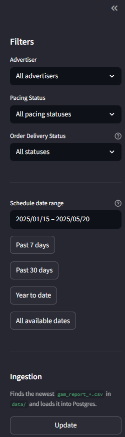
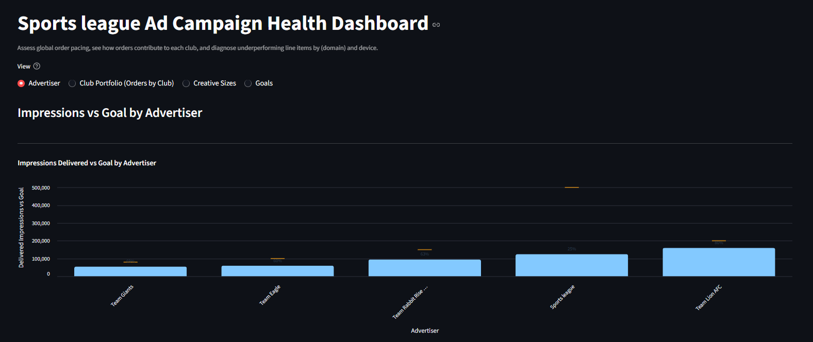
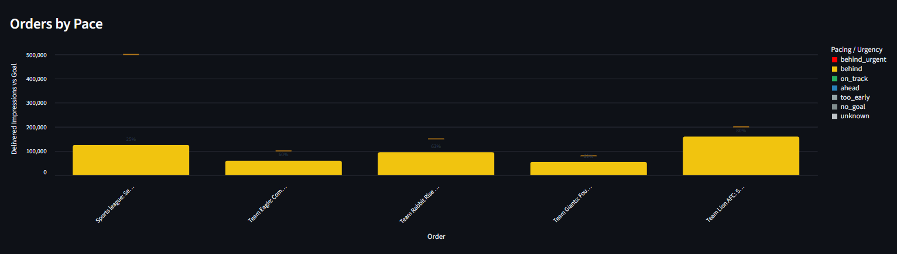
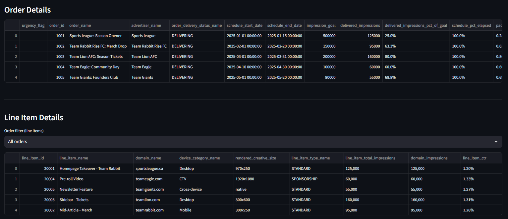
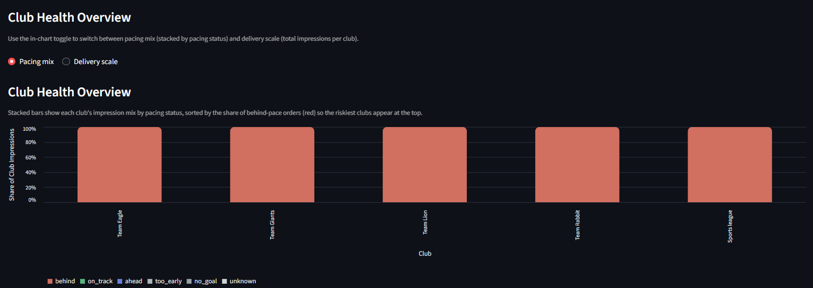
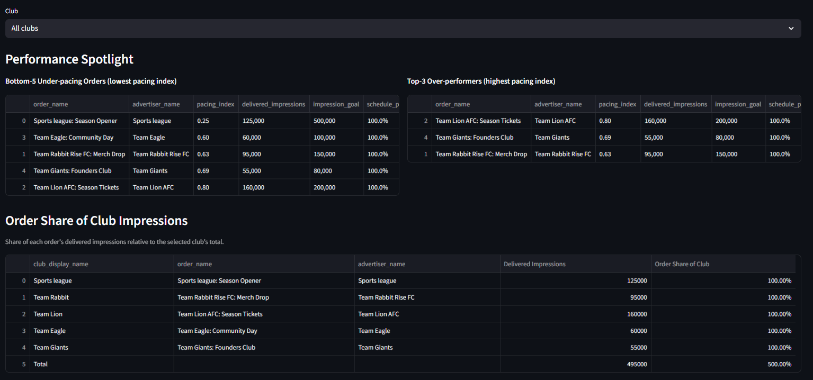
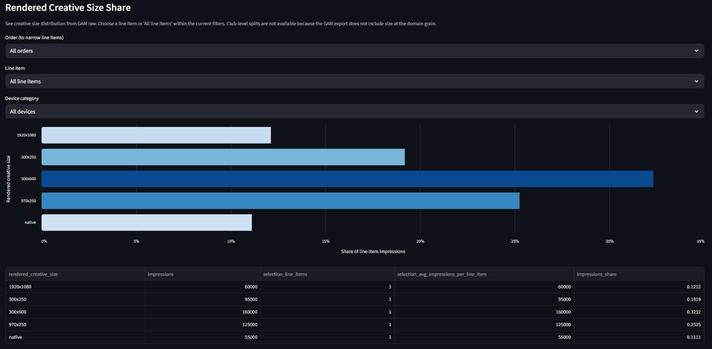
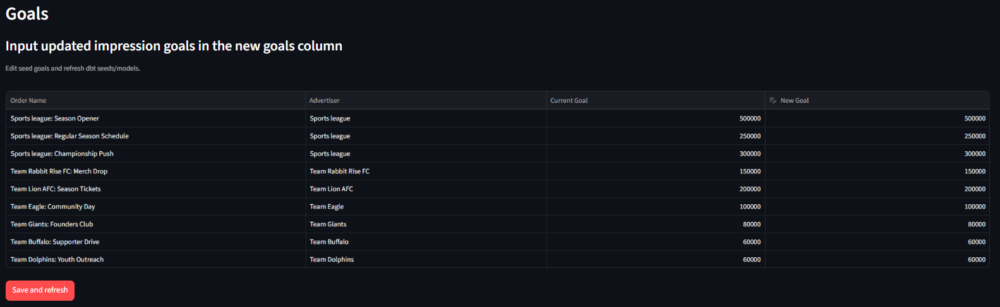

# Google Ad Campaign Health Dashboard

## About
This project creates a data pipeline that visualizes ad campaign health to help a marketing agency make ad delivery decisions. It ingests Google Ad Manager (GAM) exports into Postgres, models pacing and health, and visualizes where delivery is ahead/behind.


## Problem Statement

The marketing agency must deliver contracted impression targets to multiple advertisers within a fixed total inventory. Advertisers carry different priorities, so higher-priority clients should achieve a larger share of their promised impressions than lower-priority ones. This project provides the data models and dashboard to track pacing, diagnose concentration, and rebalance delivery before commitments are missed.

## Tech Stack

- **Docker**
- **dbt (Postgres)**: Transforms GAM raw data into marts for pacing, impression delivery, and creative-size diagnostics.
- **Streamlit**: Frontend dashboard for pacing KPIs, drilldown views, detailed diagnostics, and creative-size performance.
- **Altair**: Declarative charts inside the Streamlit app.
- **Python ingestion**: `ingestion/gam_ingest.py` loads GAM CSV exports into Postgres tables (`gam_raw`, `gam_domain_mapping`, seeds).


## Quick Start

1. Install dependencies:
   ```bash
   pip install -r requirements.txt
   ```
2. Set Postgres connection details in `.streamlit/secrets.toml` (or export env vars for dbt/ingestion).
3. Run dbt to build models:
   ```bash
   cd dbt
   dbt run
   dbt test
   ```
4. Launch the dashboard:
   ```bash
   streamlit run streamlit_app.py
   ```

## Streamlit Dashboard

- **Filters and ingestion**: Sidebar filters by advertiser, pacing status, delivery status, and schedule dates; one-click ingestion runs the latest `gam_report_*.csv` into Postgres.  
  

- **Advertiser view**: Portfolio KPIs (behind/on-track/ahead/urgent), impressions vs goal by advertiser, and order pacing bars with goal markers; drill into line-item diagnostics for any order.  
  
  
  

- **Club portfolio view**: Club health overview with pacing mix vs delivery scale toggle, optional urgent-only filter, bottom-5/top-3 pacing spotlight, and order share of club delivery to spot concentration risk.  
  
  

- **Creative sizes view**: Share of impressions by rendered creative size with optional order/line-item/device filters, plus goal context when a single order is selected.  
  

- **Goals tab**: In-app editor for `seed_partner_names_goals.csv`, then runs `dbt seed` and `dbt run` to refresh goals and marts.  
  

## Data Flow

1. Download GAM CSVs (e.g., `gam_report_*.csv`) into `data/`.
2. Run `ingestion/gam_ingest.py` (via sidebar button in Streamlit or CLI) to load into Postgres `gam_raw` and related sources.
3. dbt models transform raw data into marts:
   - `fct_gam_order_health`: order-level pacing.
   - `fct_gam_club_delivery` / `mart_gam_club_portfolio`: club-level delivery and order contribution.
   - `fct_gam_line_item_diagnostics` / `mart_gam_line_item_diagnostics_view`: domain-level diagnostics.
   - `fct_gam_line_item_creative_sizes` / `mart_gam_line_item_creative_sizes_view`: creative-size delivery with goal/delivery context.
4. Streamlit reads marts from Postgres (`schema` schema by default) to render views and filters.

## Notes

- Default dbt profile: adjust `~/.dbt/profiles.yml` (or set `DBT_PROFILES_DIR`) to point at your Postgres host and default target.
- Seed files map domains to clubs and store partner goals; update and run `dbt seed` when these change.
- The Creative Sizes tab includes order-level goal/delivery context and selection-level scale metrics (line item counts/averages) to understand whether sizes perform due to efficiency or volume.
